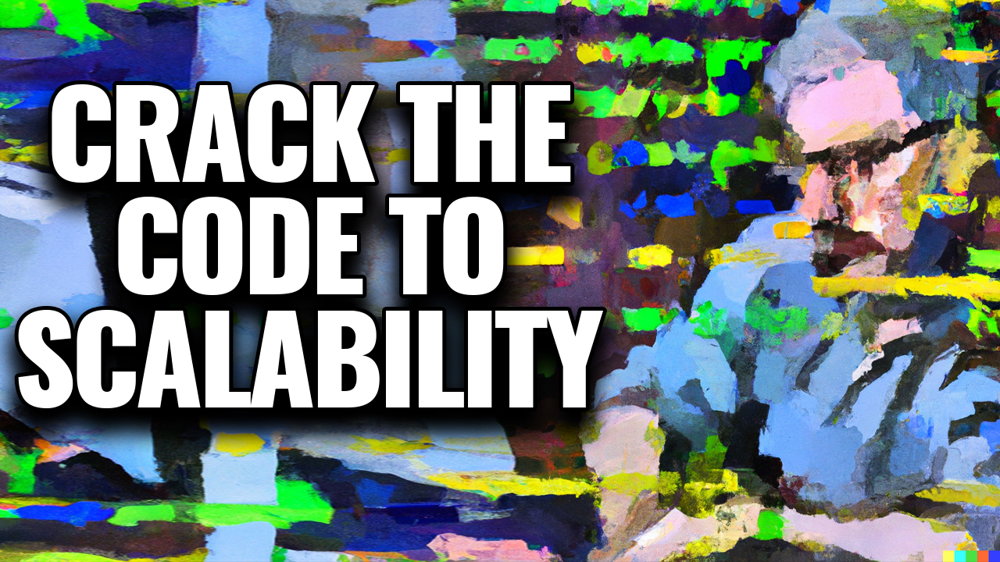

# Architect Like a Boss: Mastering Serverless Design Patterns

(Previously: Crack the Code to Scalability: Mastering Serverless Architectures for Unstoppable Apps!)

## Elevator Pitch
Ready to advance your serverless architecture skills? Join this session, where you will master serverless design patterns and learn to architect like a boss!

## Short Abstract
Discover the secrets to unleashing the full potential of serverless architecture in this captivating session. Delving into the core principles and challenges of serverless computing, the session will guide participants through proven architectural patterns that elevate the scalability and resilience of their applications. From event-driven design to microservices orchestration, attendees will gain practical insights into optimizing performance, enhancing security, and implementing effective monitoring strategies within a serverless environment. Join us for an enlightening journey into the future of cloud-native development, equipping you with the tools and knowledge to transform your projects into unstoppable, scalable wonders.

## Abstract
Are you ready to advance your serverless architecture skills? Join this dynamic session where you will master serverless design patterns and learn to architect like a boss!

In this power-packed session, we will dive deep into serverless architecture, unveiling the secrets behind building scalable, resilient, cost-effective applications. From event-driven architectures to microservices and beyond, we will explore the essential design patterns that empower you to craft serverless solutions like a seasoned pro.

Forget the guesswork and uncertainty – with expert guidance, you will gain invaluable insights and actionable strategies for tackling common challenges such as asynchronous workloads, workflow management, and error handling in the serverless realm. Whether you are a seasoned cloud architect or a curious newcomer, this session promises to equip you with the knowledge and tools to architect serverless applications with confidence and finesse.

Take advantage of this opportunity to elevate your skills and architect like a boss in serverless computing. Join us and unlock the keys to mastering serverless design patterns for unparalleled success!

# Type
- 45/60/75-minute session

## Tags
- Application Design
- Application Development
- Architectural Patterns
- Best Practices
- Cloud Architecture
- Cloud Computing
- Cloud-Native Development
- Cloud Services
- Cost Optimization
- Design Patterns
- Error Handling
- Event-Driven Architecture
- Event-Driven Design
- Microservices
- Orchestration
- Performance Optimization
- Reliability
- Resilience
- Scalability
- Serverless
- Serverless Architecture
- Serverless Computing
- Serverless Concepts

## Learning Objectives
- **Understand Key Serverless Design Patterns**: Attendees will gain a comprehensive understanding of essential serverless design patterns, including event-driven architectures, microservices, and composite applications. They will learn to apply these patterns to build scalable, resilient, cost-effective serverless solutions.
- **Learn Best Practices for Serverless Architecture**: Attendees will learn best practices for architecting serverless applications, including techniques for asynchronous workloads, workflow management, and error handling. They will gain actionable insights into overcoming common challenges and optimizing performance in serverless environments.
- **Develop Confidence in Serverless Architecture**: By the end of the session, participants will feel confident in their ability to architect serverless applications like a boss. They will have the knowledge and tools to tackle complex architectural challenges, make informed design decisions, and drive success in serverless computing.

## Presentations

| Event | Location | Date | Time | Room | Downloads |
|-------|:--------:|-----:|-----:|-----:|----------:|
| [Serverless Architecture Conference](https://serverless-architecture.io/serverless-architecture-design/serverless-application-scalability/) (as Crack the Code to Scalability) | London, UK | April 9, 2024 | 16:00 BST | TBA | [Slides](./EventMaterials/CrackTheCodeToScalability-SACLondon24.pdf) |

## Resources
There are no additional resources for this presentation.

Email [chadgreen@chadgreen.com](mailto:chadgreen@chadgreen.com?subject=Presentation%20Request:%20Crack%20the%20Code%20to%20Scalability) to have Chad present this session at your event.